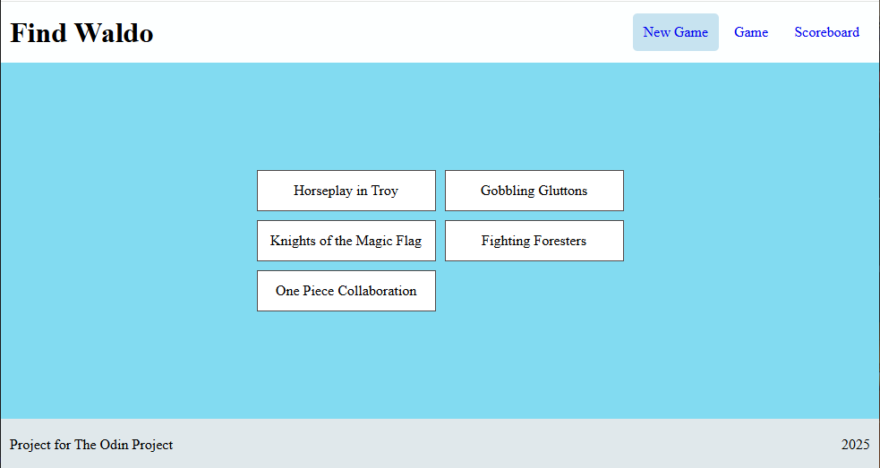

## Where is Waldo - Photo Tagging App

Where is Waldo App is a project for [The Odin Project](https://www.theodinproject.com/lessons/nodejs-where-s-waldo-a-photo-tagging-app) built with Express and React. Click anywhere in the image to open a dropdown menu to select the character to be guessed. Game is timed and added to Leaderboard under a name if the player wishes.  

Images from https://archive.org/details/wheres-waldo-archive  
frontend https://github.com/John-Rashta/odin-where-is-waldo-frontend  
App deployed [here](https://odin-where-is-waldo-frontend-production.up.railway.app/)

## Features
- **Selection Validation**
- **Leaderboard**

## TechStack

**Backend**:  
- **Node.js (TypeScript)**
- **Express**
- **Prisma**
- **PostgreSQL**  

**Frontend**:
- **React**
- **Vite**
- **React Router**
- **Redux + RTK Query**

**Deployment**:
- **Railway**

